# Raccolta Esercizi di Algoritmi e Flowchart

Questo repository contiene la raccolta completa degli esercizi di logica, algoritmi e diagrammi di flusso svolti durante le esercitazioni. I diagrammi sono integrati direttamente nel documento tramite codice Mermaid.js e vengono renderizzati nativamente da GitHub.

---

## SEZIONE 1 - Algoritmi Sequenziali e Condizionali Semplici

### Esercizio 1: Calcolo dell'Area di un Rettangolo
[cite_start]Algoritmo che, dati i due lati di un rettangolo, calcola e fornisce in output l'area[cite: 9].
* [cite_start]**Dati di input:** base, altezza [cite: 10]
* [cite_start]**Dati di output:** area [cite: 10]

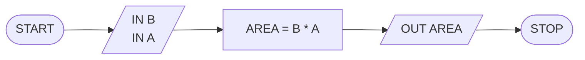

### Esercizio 2: Area e Perimetro del Cerchio
[cite_start]Algoritmo che riceve in ingresso il raggio di un cerchio e calcola sia l'area che il perimetro[cite: 17].
* [cite_start]**Dati di input:** raggio [cite: 18]
* [cite_start]**Dati di output:** area, perimetro [cite: 19]

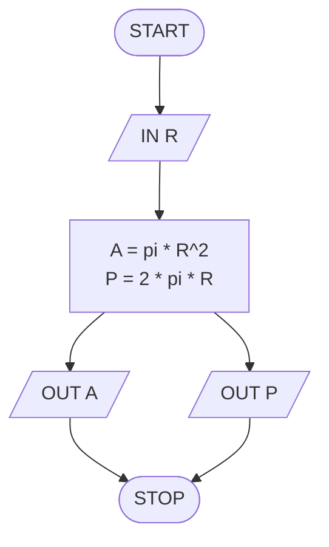

### Esercizio 3: Il Maggiore tra Due Numeri
[cite_start]Algoritmo che, dati due numeri diversi, restituisce il valore maggiore[cite: 33].
* [cite_start]**Dati di input:** due numeri x e y [cite: 34]
* [cite_start]**Dati di output:** il numero maggiore [cite: 34]

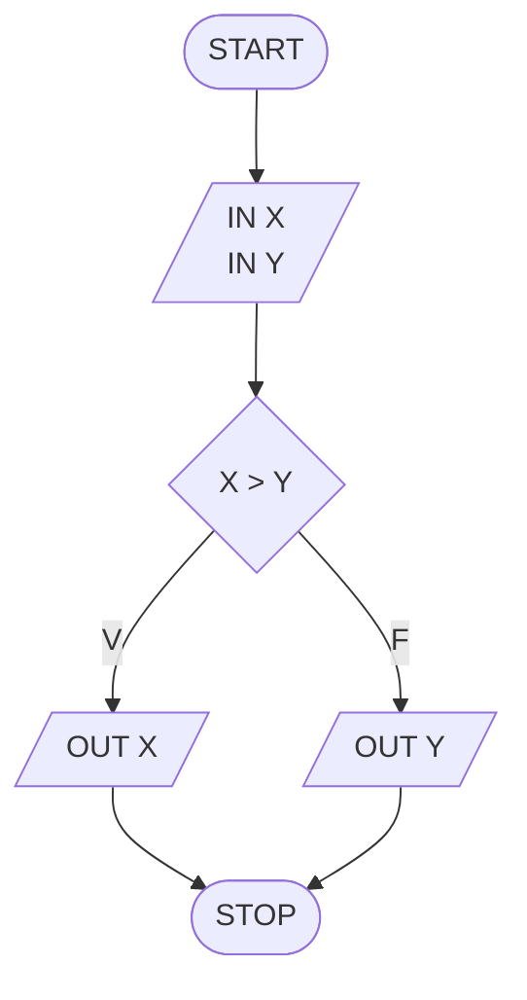

### Esercizio 4: Calcolo Costo Visita Museo e Controllo Budget
[cite_start]Algoritmo che calcola il costo totale della visita per un gruppo di studenti[cite: 52]. [cite_start]Nel caso in cui il costo sia superiore a 100, segnala un avviso di "Over Budget"[cite: 53].
* [cite_start]**Dati di input:** numero studenti (n), prezzo biglietto (p) [cite: 54]
* [cite_start]**Dati di output:** costo totale (c), avviso [cite: 54]

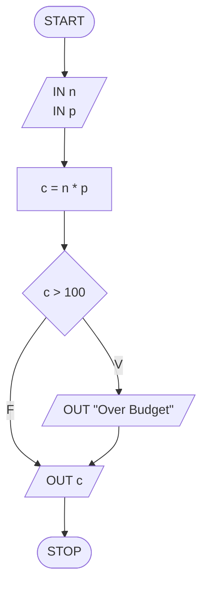

---

### Esercizio 5: Differenza o Somma con Convalida dell'Input
[cite_start]Dati in ingresso due valori diversi, l'algoritmo calcola e fornisce in output la loro differenza se il primo è maggiore del secondo, altrimenti la loro somma[cite: 96]. [cite_start]Include una deviazione di controllo per verificare che i valori inseriti non siano uguali[cite: 120, 125].
* [cite_start]**Dati di input:** x e y [cite: 97]
* [cite_start]**Dati di output:** d (differenza) oppure s (somma) [cite: 98]

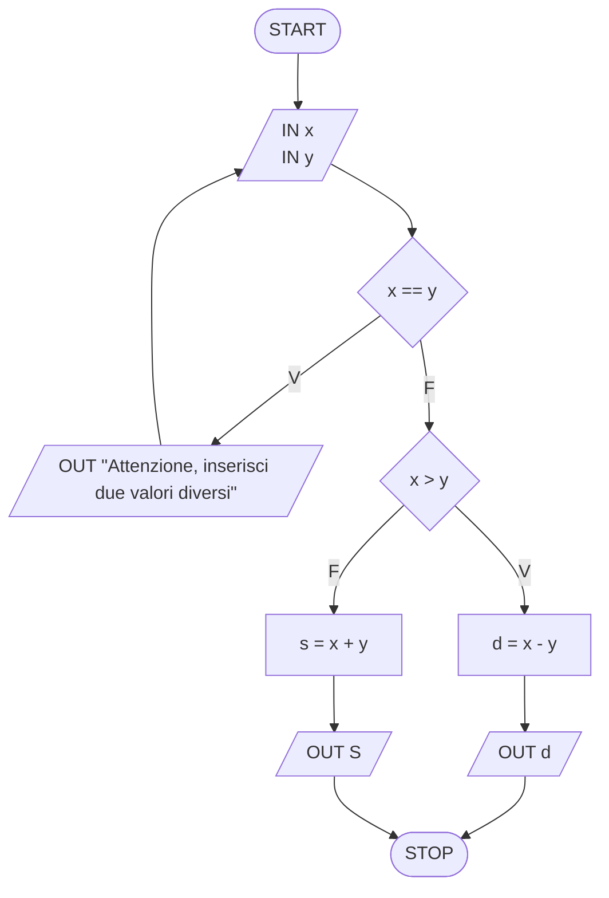

### Esercizio 6: Moltiplicazione o Selezione Valore in Base al Segno
[cite_start]Dati in ingresso due valori, se il primo valore è positivo l'algoritmo fornisce in output la loro moltiplicazione, altrimenti se il primo valore è negativo manda in output direttamente il secondo valore[cite: 140].
* [cite_start]**Dati di input:** x e y [cite: 141]
* [cite_start]**Dati di output:** m (moltiplicazione) oppure y [cite: 142]

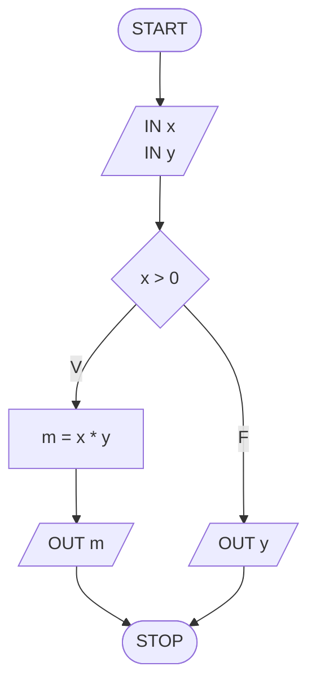

### Esercizio 7: Controllo Pari o Dispari
[cite_start]Dato in ingresso un valore che deve essere diverso da 0, l'algoritmo restituisce se tale numero è pari o dispari[cite: 161].
* [cite_start]**Dati di input:** un valore x [cite: 162]
* [cite_start]**Dati di output:** messaggio "Pari" o "Dispari" [cite: 163]

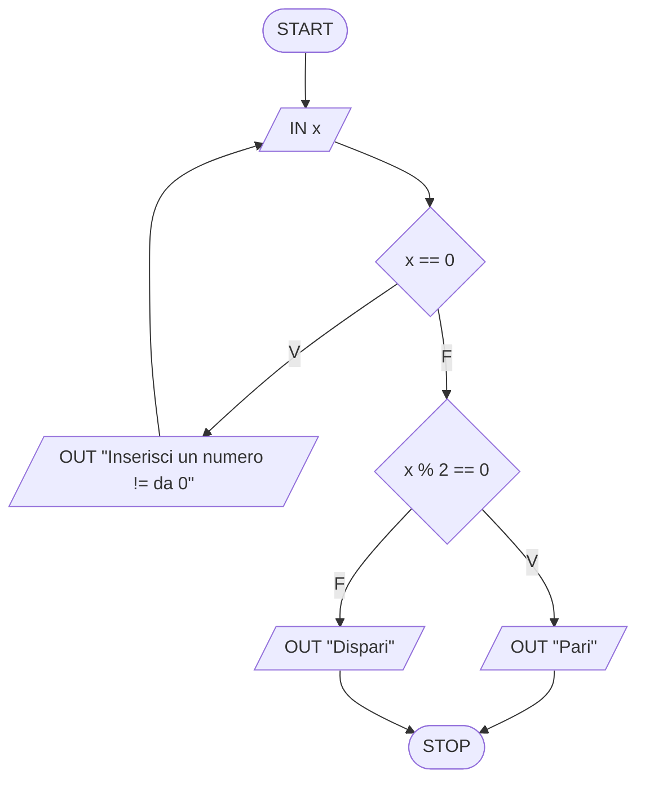

---

### Esercizio 8: Somma Valori Esclusivamente Positivi
[cite_start]Dati in ingresso due valori qualsiasi, l'algoritmo fornisce in output i valori sommati solo se entrambi sono maggiori di 0, altrimenti segnala errore[cite: 187].
* [cite_start]**Dati di input:** X, Y [cite: 188]
* [cite_start]**Dati di output:** Somma o messaggio "Errore" [cite: 189, 197]

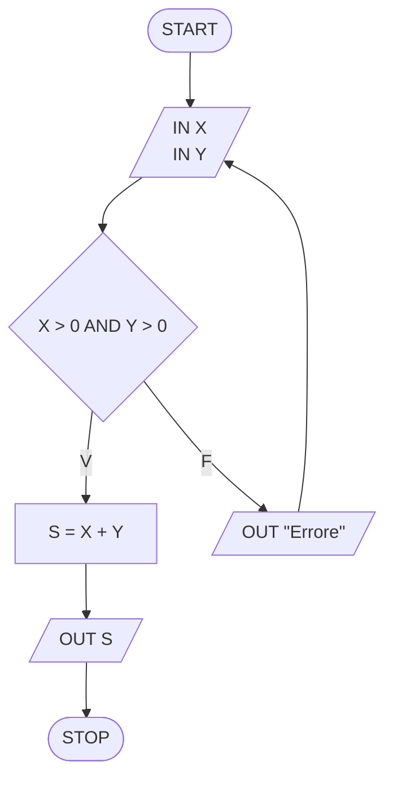

### Esercizio 9: Somma Selettiva dei Valori Pari
[cite_start]Dati in ingresso due valori, l'algoritmo analizza i singoli elementi inseriti e ne accumula il valore solo se si tratta di numeri pari[cite: 198].
* [cite_start]**Dati di input:** X, Y [cite: 198]
* [cite_start]**Dati di output:** Somma totale dei valori pari S [cite: 200, 206]

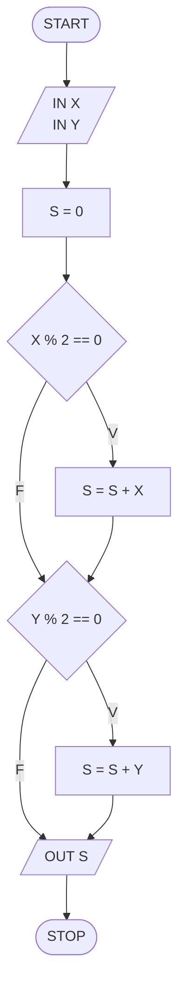

---

### Esercizio 10: Output Esclusivo di Valori Dispari
[cite_start]Dati in ingresso due valori, l'algoritmo esegue un controllo di disparità e fornisce in output solo i valori che risultano dispari[cite: 217].
* [cite_start]**Dati di input:** due valori (x, y) [cite: 218]
* [cite_start]**Dati di output:** i singoli valori dispari identificati [cite: 219]

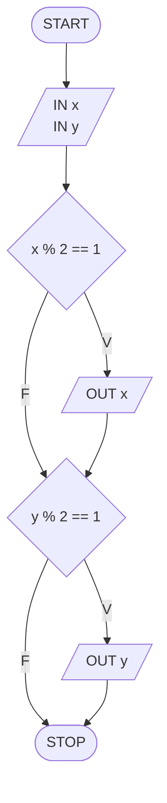

### Esercizio 11: Calcolo Somma dei Valori Dispari
[cite_start]Dati in ingresso due valori, l'algoritmo effettua una verifica e restituisce la somma cumulativa dei soli valori inseriti che risultano dispari[cite: 232].
* [cite_start]**Dati di input:** due valori (x, y) [cite: 233]
* [cite_start]**Dati di output:** la somma dei valori dispari sd [cite: 234]

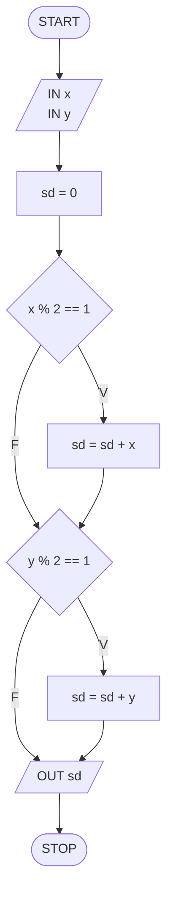

---

### Esercizio 12: Il Maggiore tra Tre Numeri
[cite_start]Dati tre numeri in ingresso, l'algoritmo analizza le relazioni d'ordine tramite condizioni logiche e fornisce in output il valore massimo[cite: 247].
* [cite_start]**Dati di input:** tre valori (x, y, z) [cite: 271]
* [cite_start]**Dati di output:** il valore massimo max [cite: 272]

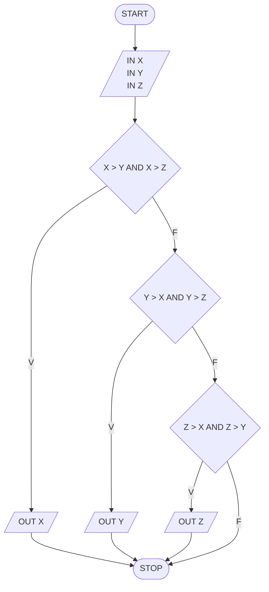

### Esercizio 13: Somma dei Numeri Pari Maggiori di Zero
[cite_start]Dati tre numeri, l'algoritmo verifica per ciascuno se rispetta contemporaneamente la condizione di essere maggiore di zero e un numero pari, calcolandone e restituendone la somma cumulativa[cite: 305].
* **Dati di input:** tre numeri
* **Dati di output:** la somma dei numeri conformi alle specifiche

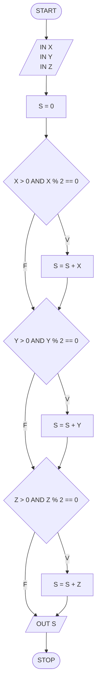

---

## SEZIONE 2 - Strutture Iterative

### Esercizio 1: Iterazione Numeri da 0 a 3
[cite_start]Esempio base di applicazione di un ciclo definito tramite una variabile contatore per inviare in output i numeri in sequenza da 0 a 3 compreso[cite: 319].
* [cite_start]**Dati di input:** nessuno [cite: 320]
* [cite_start]**Dati di output:** i singoli numeri da 0 a 3 [cite: 321]

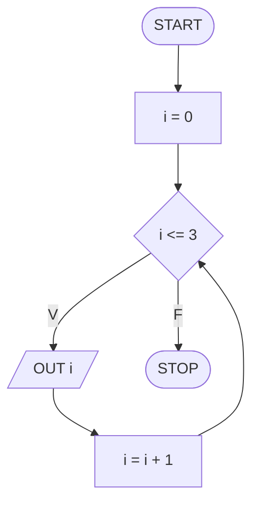

### Esercizio 2: Output Numeri Pari da 0 a 5
[cite_start]L'algoritmo esegue un ciclo da 0 a 5 integrando un controllo interno per individuare e stampare in output esclusivamente i valori pari incontrati durante l'iterazione[cite: 335].
* **Dati di input:** nessuno
* **Dati di output:** i numeri pari compresi nell'intervallo esaminato

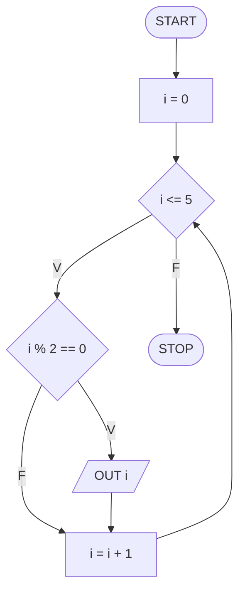

---

### Esercizio 3: Somma Progressiva dei Numeri da 0 a 10
[cite_start]L'algoritmo esegue un ciclo iterativo per calcolare e restituire la somma cumulativa di tutti i numeri interi compresi nell'intervallo tra 0 e 10[cite: 348].
* [cite_start]**Dati di input:** nessuno [cite: 349]
* [cite_start]**Dati di output:** la somma complessiva s [cite: 350]

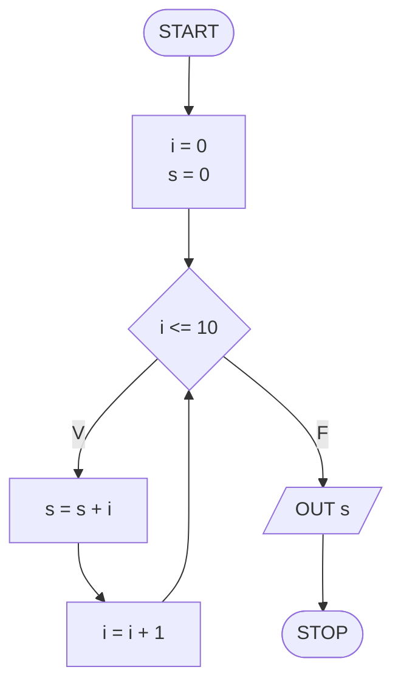

### Esercizio 4: Somma dei Numeri Dispari da 5 a 15
[cite_start]L'algoritmo esegue un conteggio ciclico a partire dal valore iniziale 5 fino al limite 15, verificando la disparità di ogni elemento e accumulandone il valore della somma[cite: 363].
* [cite_start]**Dati di input:** nessuno [cite: 364]
* [cite_start]**Dati di output:** la somma finale dei numeri dispari sd [cite: 365]

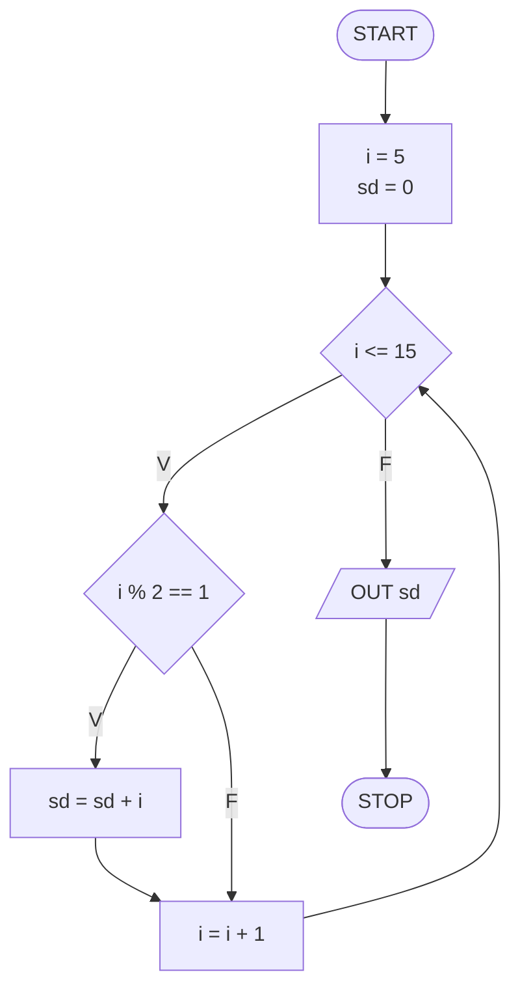

---

### Esercizio 5: Somma Iterativa Fino a un Limite x Definito dall'Utente
[cite_start]Dato un numero positivo in ingresso, l'algoritmo esegue un ciclo per calcolare e stampare in output la somma di tutti i valori compresi tra 0 e quel numero[cite: 383]. [cite_start]Include un ciclo di validazione iniziale (ciclo while) per garantire la positività dell'input[cite: 383, 391, 406].
* [cite_start]**Dati di input:** un valore x [cite: 384]
* [cite_start]**Dati di output:** la somma progressiva calcolata s [cite: 385, 393]

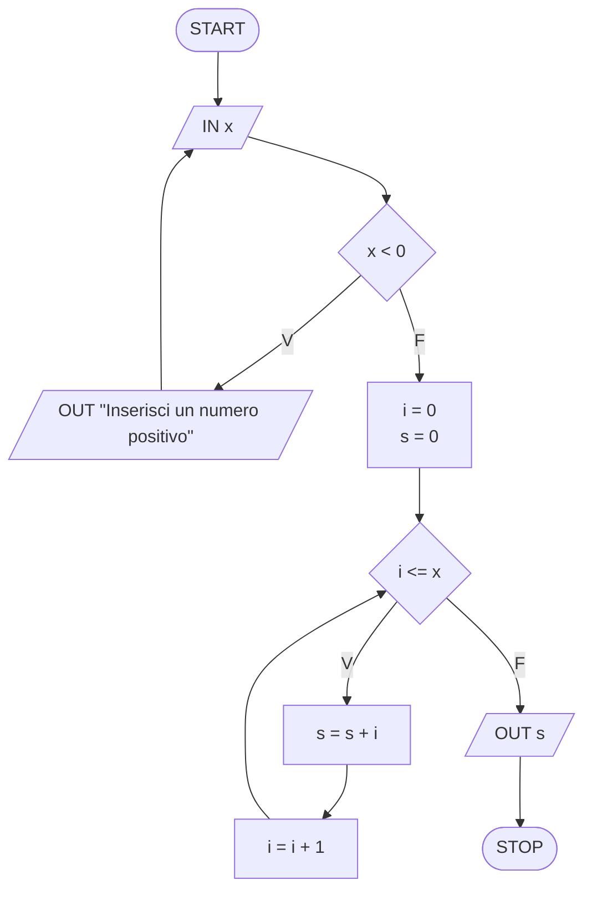

---

## RIPASSO 
### Esercizio 1: Algoritmo Sequenziale Puro
[cite_start]Esempio di struttura lineare in sequenza che riceve due valori in ingresso, calcola contemporaneamente la loro somma e la loro moltiplicazione, emettendo entrambi i risultati in output[cite: 411, 412].
* [cite_start]**Dati di input:** due valori (x, y) [cite: 413]
* [cite_start]**Dati di output:** somma (s) e moltiplicazione (m) [cite: 414]

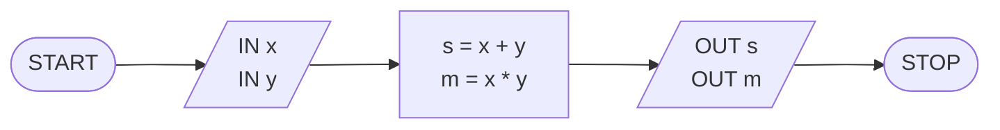

### Esercizio 2: Algoritmo di Selezione Condizionale
[cite_start]Struttura a selezione condizionale che valuta il valore di un'età inserita in ingresso per stabilire e comunicare testualmente se la persona è maggiorenne o minorenne[cite: 422, 423].
* [cite_start]**Dati di input:** età [cite: 424]
* [cite_start]**Dati di output:** stringa di messaggio "Maggiorenne" o "Minorenne" [cite: 425]

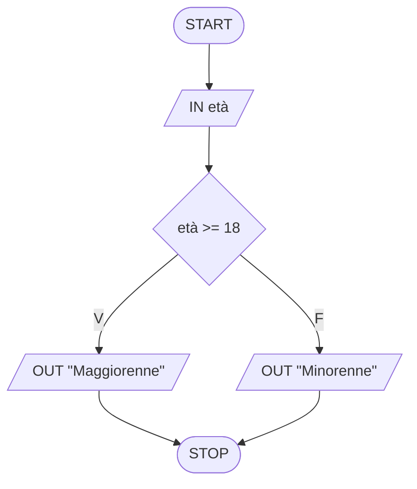

### Esercizio 3: Algoritmo di Ciclo Definito (Tabellina)
[cite_start]Dato un numero x inserito in input, l'algoritmo calcola e restituisce in sequenza i valori della corrispondente tabellina moltiplicando l'input per un contatore che si incrementa da 0 a 10[cite: 435, 436].
* [cite_start]**Dati di input:** un numero x [cite: 437]
* [cite_start]**Dati di output:** i singoli valori calcolati della tabellina t [cite: 437]

```mermaid
graph TD
    START([START]) --> INPUT[/IN x/]
    INPUT --> INIT[i = 0]
    INIT --> COND{i <= 10}
    COND -- V --> PROCESS[t = x * i]
    PROCESS --> OUTPUT[/OUT t/]
    OUTPUT --> INC[i = i + 1]
    INC --> COND
    COND -- F --> STOP([STOP])
```

### Esercizio 4: Algoritmo di Ciclo Indefinito (Somma ad Oltranza)
[cite_start]L'algoritmo riceve e somma numeri inseriti dall'utente in modo indefinito fino a quando la somma progressiva calcolata supera il valore limite di 100, mostrando poi il risultato finale della somma[cite: 451, 452].
* [cite_start]**Dati di input:** una serie indefinita di valori inseriti x [cite: 453]
* [cite_start]**Dati di output:** la somma complessiva finale s [cite: 454]

```mermaid
graph TD
    START([START]) --> INIT[s = 0]
    INIT --> INPUT[/in x/]
    INPUT --> PROCESS[s = s + x]
    PROCESS --> COND{s <= 100}
    COND -- V --> INPUT
    COND -- F --> OUTPUT[/out s/]
    OUTPUT --> STOP([STOP])
```
