# Soluzioni – Raccolta Esercizi di Algoritmi e Flowchart

Soluzioni degli esercizi della raccolta. Prova sempre a risolvere l'esercizio **prima** di guardare la soluzione, poi verifica il tuo flowchart con i casi prova.

**Convenzioni usate nei diagrammi**

- `=` indica un'assegnazione (`s = s + x`: "s diventa s + x").
- `==` indica un confronto di uguaglianza ("sono uguali?"), `!=` "sono diversi?". Si usano solo nei rombi.
- `%` è il resto della divisione, `//` la divisione intera.
- `V` / `F` sono le uscite Vero / Falso di una decisione.

Spesso esiste più di una soluzione corretta: se la tua è diversa ma supera tutti i casi prova, va bene.

---

## SEZIONE 1 – Sequenza e Selezione

### S1-E1: Area di un Rettangolo

* **Dati di input:** base, altezza
* **Dati di output:** area

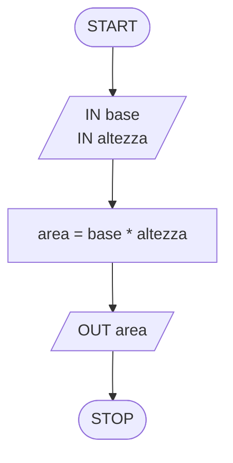

[Torna all'esercizio](README.md#s1-e1-area-di-un-rettangolo)

---

### S1-E2: Area e Lunghezza della Circonferenza

* **Dati di input:** raggio r
* **Dati di output:** area del cerchio, lunghezza della circonferenza circ

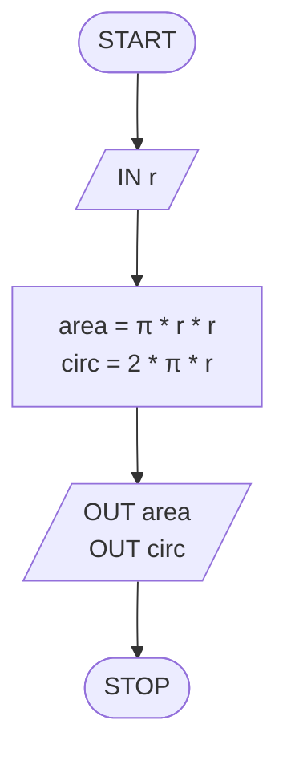

**Nota:** in un flowchart il flusso non si divide mai senza un rombo: i due output sono in sequenza. Per il quadrato del raggio usa `r * r`.

[Torna all'esercizio](README.md#s1-e2-area-e-lunghezza-della-circonferenza)

---

### S1-E3: Il Maggiore tra Due Numeri

* **Dati di input:** due numeri x, y
* **Dati di output:** il maggiore, oppure il messaggio "I numeri sono uguali"

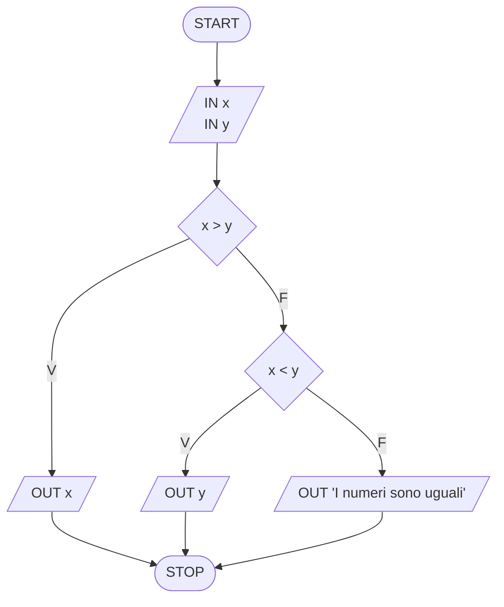

[Torna all'esercizio](README.md#s1-e3-il-maggiore-tra-due-numeri)

---

### S1-E4: Prodotto e Controllo di Soglia

* **Dati di input:** due numeri x, y
* **Dati di output:** prodotto p, eventuale messaggio "Soglia superata"

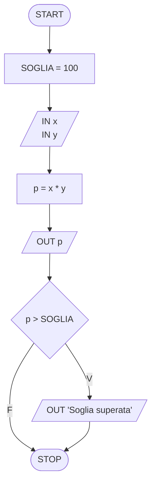

**Nota:** con 20 e 5 il prodotto è esattamente 100 e il messaggio **non** compare, perché la condizione è `>`.

[Torna all'esercizio](README.md#s1-e4-prodotto-e-controllo-di-soglia)

---

### S1-E5: Differenza o Somma con Convalida dell'Input

* **Dati di input:** due valori x, y
* **Dati di output:** differenza d oppure somma s, oppure messaggio di errore

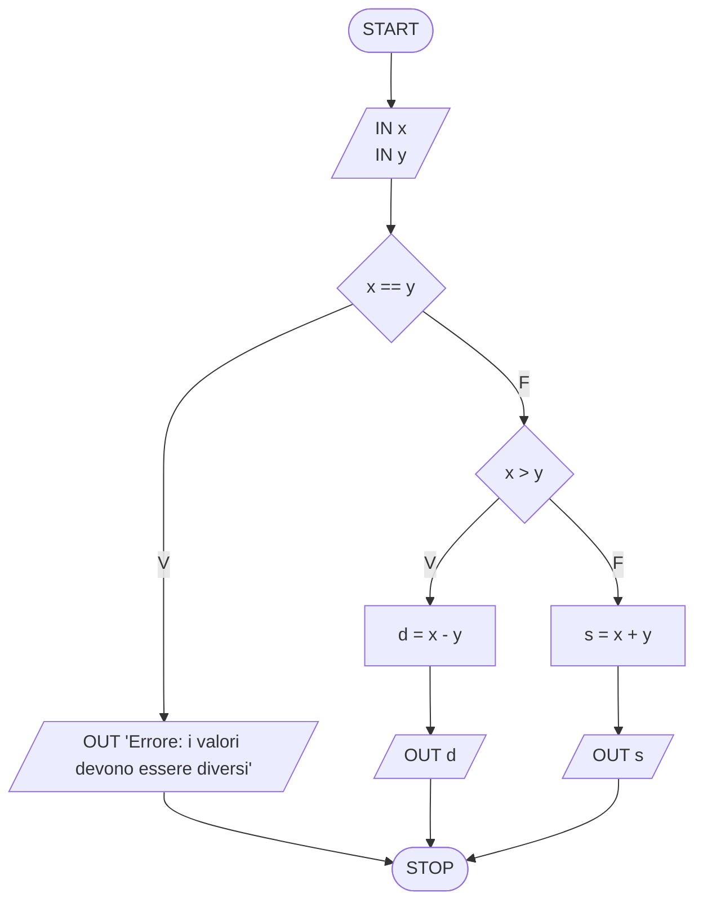

**Nota:** l'algoritmo termina dopo l'errore. Una freccia che torna all'input formerebbe un ciclo, che vedremo nella Sezione 2.

[Torna all'esercizio](README.md#s1-e5-differenza-o-somma-con-convalida-dellinput)

---

### S1-E6: Moltiplicazione o Selezione in Base al Segno

* **Dati di input:** due valori x, y
* **Dati di output:** prodotto m oppure y, oppure messaggio "Il primo valore è zero"

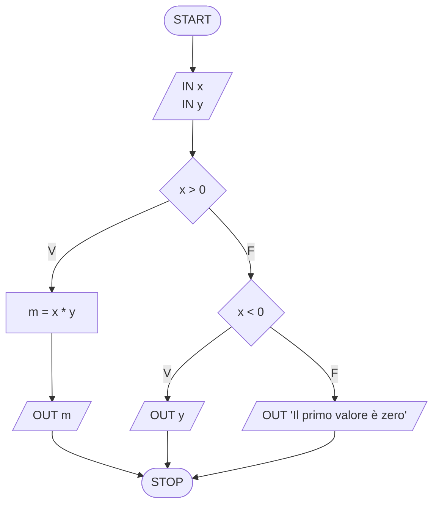

[Torna all'esercizio](README.md#s1-e6-moltiplicazione-o-selezione-in-base-al-segno)

---

### S1-E7: Pari o Dispari

* **Dati di input:** un numero intero x
* **Dati di output:** messaggio "pari" o "dispari", oppure messaggio di errore

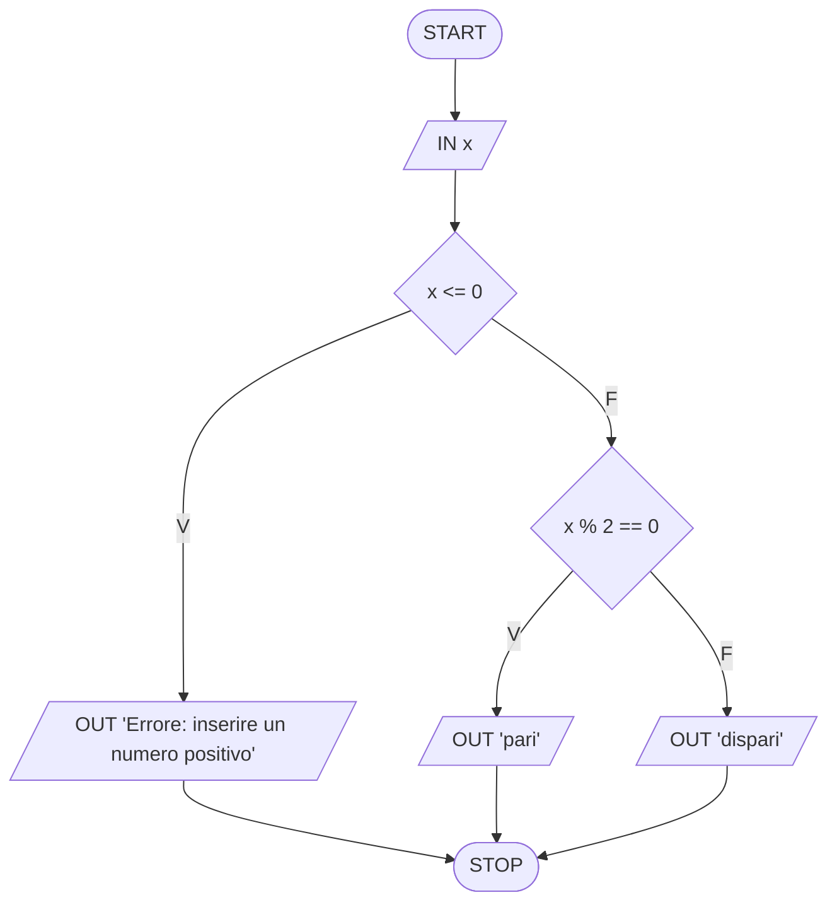

[Torna all'esercizio](README.md#s1-e7-pari-o-dispari)

---

### S1-E8: Somma di Valori Esclusivamente Positivi

* **Dati di input:** due valori x, y
* **Dati di output:** somma s oppure messaggio "Errore"

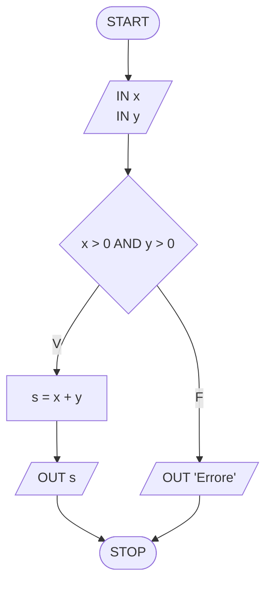

[Torna all'esercizio](README.md#s1-e8-somma-di-valori-esclusivamente-positivi)

---

### S1-E9: Somma dei Valori Assoluti (accumulatore)

* **Dati di input:** due numeri x, y
* **Dati di output:** somma s dei valori assoluti

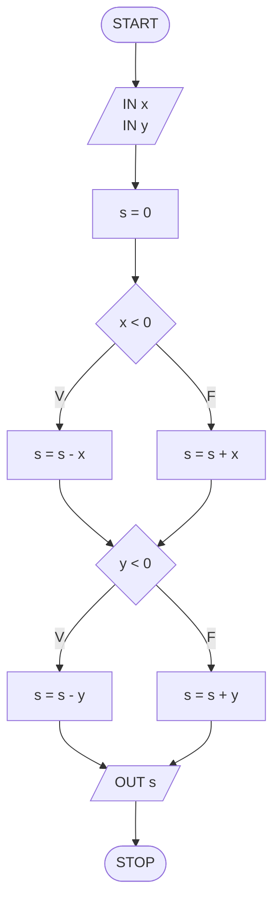

**Nota:** sottrarre un numero negativo equivale a sommare il suo opposto: se x vale -3, `s - x` aggiunge 3. In alternativa si può scrivere `s = s + (-x)`.

[Torna all'esercizio](README.md#s1-e9-somma-dei-valori-assoluti-accumulatore)

---

### S1-E10: Positivi, Negativi e Nulli (contatore)

* **Dati di input:** due numeri x, y
* **Dati di output:** numero di positivi pos, di negativi neg, di nulli nul

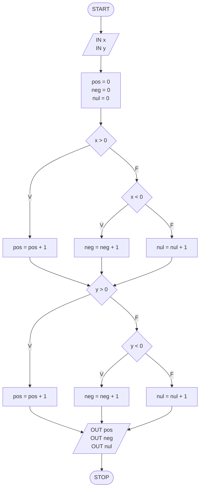

**Nota:** per ogni numero viene incrementato **esattamente uno** dei tre contatori, perché un numero è sempre o positivo, o negativo, o nullo. Per questo la somma dei tre conteggi vale sempre 2. Confronta con S1-E9: la struttura è simile, ma qui si aggiunge sempre **1** invece del valore.

[Torna all'esercizio](README.md#s1-e10-positivi-negativi-e-nulli-contatore)

---

### S1-E11: Classificazione di un Triangolo

* **Dati di input:** lunghezze dei tre lati a, b, c
* **Dati di output:** tipo di triangolo (equilatero, isoscele, scaleno) oppure messaggio "Il triangolo non esiste"

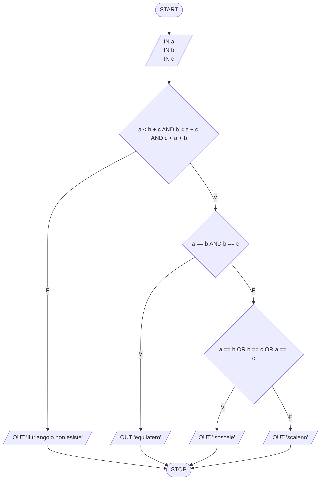

**Nota:** il confronto è stretto (`<`): con i lati 2, 3, 5 si ha 5 = 2 + 3 e i tre segmenti, invece di formare un triangolo, si sovrappongono su una retta. Una curiosità: se le tre disuguaglianze sono vere, i lati sono per forza tutti positivi. Sommando le ultime due, infatti, si ottiene b + c < 2a + b + c, cioè a > 0 (e lo stesso vale per b e c). Non serve quindi un controllo separato.

[Torna all'esercizio](README.md#s1-e11-classificazione-di-un-triangolo)

---

### S1-E12: Il Maggiore tra Tre Numeri

* **Dati di input:** tre numeri x, y, z
* **Dati di output:** il valore massimo

**Soluzione A – condizioni composte**

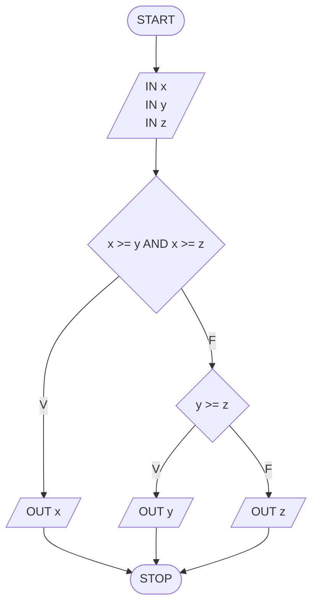

**Soluzione B – selezioni annidate**

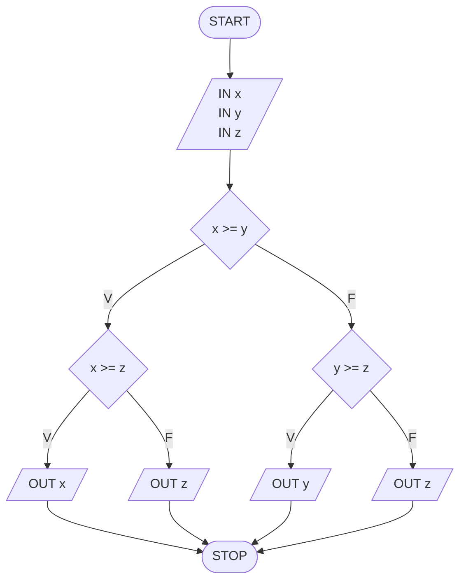

**Nota:** si usa `>=` e non `>`. Con `>` e l'input 7, 7, 2 nessuna condizione sarebbe vera e l'algoritmo non mostrerebbe nulla. Nella Soluzione A, se x non è il massimo, il massimo è per forza y oppure z: basta confrontare loro due.

[Torna all'esercizio](README.md#s1-e12-il-maggiore-tra-tre-numeri)

---

### S1-E13: Somma dei Numeri Pari e Positivi

* **Dati di input:** due numeri x, y
* **Dati di output:** somma s dei numeri pari e maggiori di zero

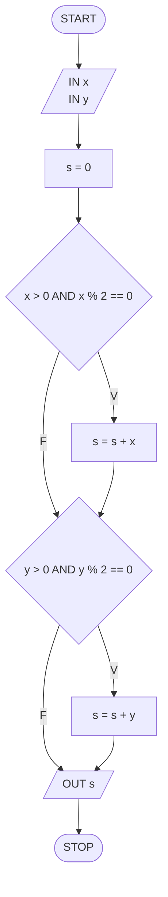

[Torna all'esercizio](README.md#s1-e13-somma-dei-numeri-pari-e-positivi)

---

### S1-E14: Decine e Unità

* **Dati di input:** un numero intero n
* **Dati di output:** cifra delle decine d, cifra delle unità u, somma s, oppure messaggio "Errore"

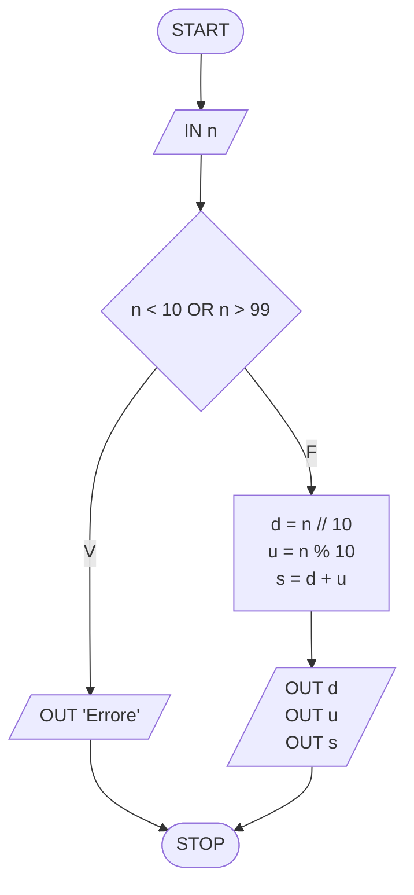

[Torna all'esercizio](README.md#s1-e14-decine-e-unità)

---

## SEZIONE 2 – Strutture Iterative

### Parte A – Cicli a conteggio

### S2-E1: Numeri da 0 a 3

* **Dati di input:** nessuno
* **Dati di output:** i numeri da 0 a 3

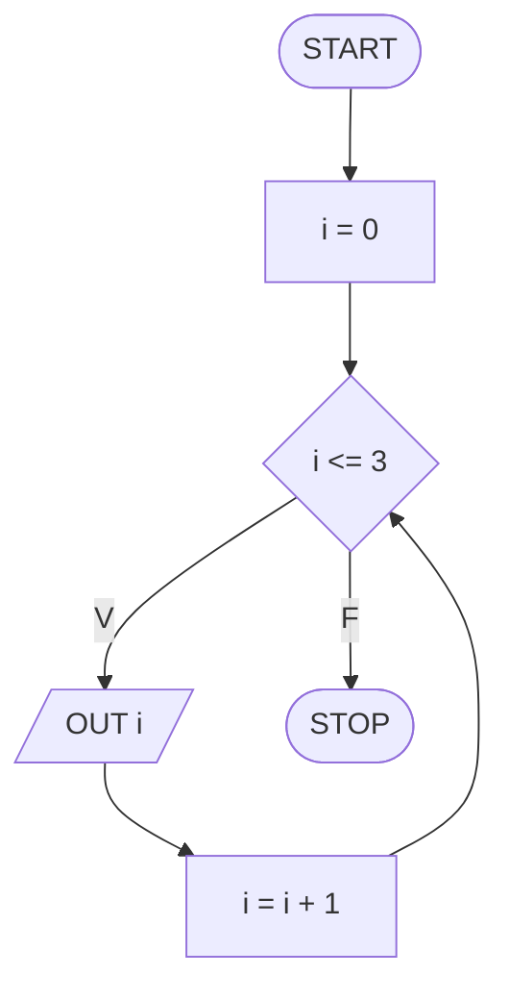

[Torna all'esercizio](README.md#s2-e1-numeri-da-0-a-3)

---

### S2-E2: Numeri Pari da 0 a 5

* **Dati di input:** nessuno
* **Dati di output:** i numeri pari da 0 a 5

**Soluzione A – passo 1 con controllo**

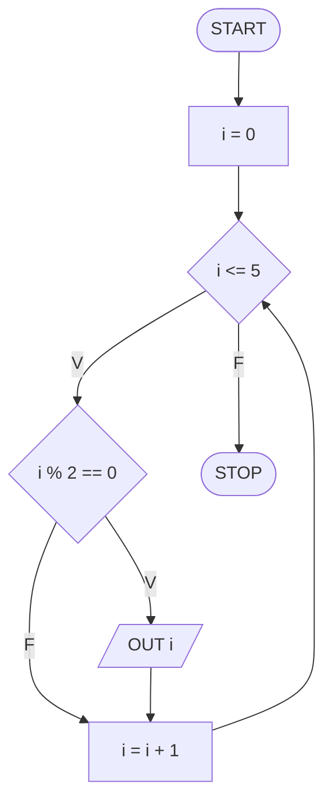

**Soluzione B – passo 2, senza controllo**


**Nota:** la Soluzione A esegue 6 iterazioni e 6 controlli, la B solo 3 iterazioni. Il risultato è lo stesso.

[Torna all'esercizio](README.md#s2-e2-numeri-pari-da-0-a-5)

---

### S2-E3: Somma dei Numeri da 0 a 10

* **Dati di input:** nessuno
* **Dati di output:** somma s

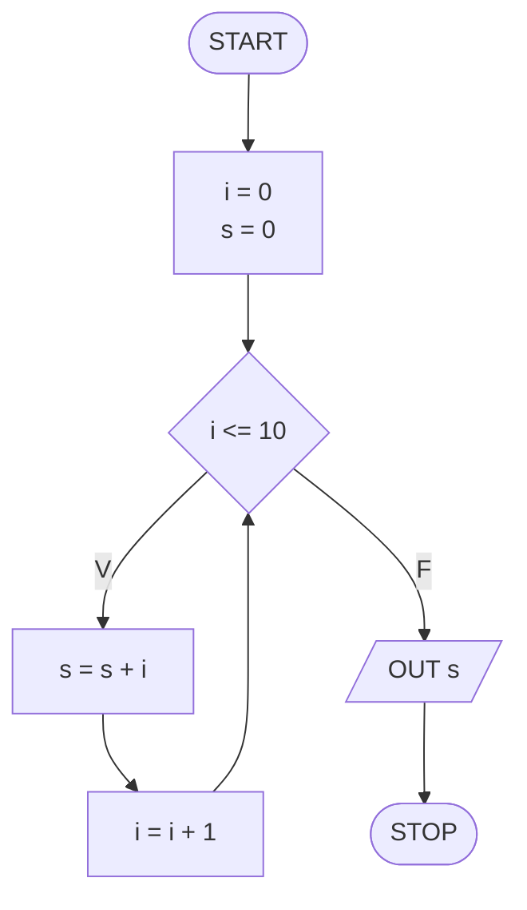

[Torna all'esercizio](README.md#s2-e3-somma-dei-numeri-da-0-a-10)

---

### S2-E4: Somma dei Numeri Dispari da 5 a 15

* **Dati di input:** nessuno
* **Dati di output:** somma sd dei numeri dispari

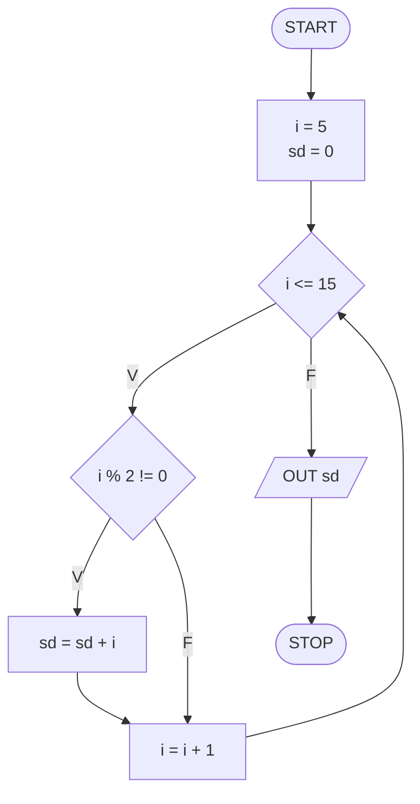

[Torna all'esercizio](README.md#s2-e4-somma-dei-numeri-dispari-da-5-a-15)

---

### S2-E5: Quanti Multipli di 3?

* **Dati di input:** nessuno
* **Dati di output:** numero conta di multipli di 3

```mermaid
graph TD
    START([START]) --> INIT["i = 1<br>conta = 0"]
    INIT --> COND{"i <= 30"}
    COND -- V --> CHK{"i % 3 == 0"}
    CHK -- V --> PROC["conta = conta + 1"]
    CHK -- F --> INC["i = i + 1"]
    PROC --> INC
    INC --> COND
    COND -- F --> OUTPUT[/"OUT conta"/]
    OUTPUT --> STOP([STOP])
```

[Torna all'esercizio](README.md#s2-e5-quanti-multipli-di-3)

---

### S2-E6: Il Massimo tra N Numeri

* **Dati di input:** quantità di numeri N, poi N numeri x
* **Dati di output:** il valore massimo max

```mermaid
graph TD
    START([START]) --> INN[/"IN N"/]
    INN --> IN1[/"IN x"/]
    IN1 --> INIT["max = x<br>i = 2"]
    INIT --> COND{"i <= N"}
    COND -- V --> INX[/"IN x"/]
    INX --> CHK{"x > max"}
    CHK -- V --> UPD["max = x"]
    CHK -- F --> INC["i = i + 1"]
    UPD --> INC
    INC --> COND
    COND -- F --> OUTPUT[/"OUT max"/]
    OUTPUT --> STOP([STOP])
```

**Nota:** il primo numero viene letto **prima** del ciclo e diventa il massimo iniziale, quindi il contatore parte da 2. Il testo garantisce che N ≥ 1: senza questa condizione l'algoritmo leggerebbe un numero anche con N = 0.

[Torna all'esercizio](README.md#s2-e6-il-massimo-tra-n-numeri)

---

### Parte B – Cicli indefiniti

### S2-E7: Somma da 0 a x con Validazione

* **Dati di input:** un numero x (da validare)
* **Dati di output:** somma s

```mermaid
graph TD
    START([START]) --> INPUT[/"IN x"/]
    INPUT --> CHK{"x <= 0"}
    CHK -- V --> ERR[/"OUT 'Inserisci un numero positivo'"/]
    ERR --> INPUT
    CHK -- F --> INIT["i = 0<br>s = 0"]
    INIT --> COND{"i <= x"}
    COND -- V --> PROC["s = s + i"]
    PROC --> INC["i = i + 1"]
    INC --> COND
    COND -- F --> OUTPUT[/"OUT s"/]
    OUTPUT --> STOP([STOP])
```

**Nota:** la freccia che da `ERR` torna all'input forma il ciclo di validazione: si ripete **finché** x non è positivo.

[Torna all'esercizio](README.md#s2-e7-somma-da-0-a-x-con-validazione)

---

### S2-E8: C'è un Numero Negativo?

* **Dati di input:** quantità di numeri N, poi N numeri x
* **Dati di output:** messaggio "Presente almeno un negativo" o "Nessun negativo"

```mermaid
graph TD
    START([START]) --> INN[/"IN N"/]
    INN --> INIT["neg = Falso<br>i = 1"]
    INIT --> COND{"i <= N"}
    COND -- V --> INX[/"IN x"/]
    INX --> CHK{"x < 0"}
    CHK -- V --> FLAG["neg = Vero"]
    CHK -- F --> INC["i = i + 1"]
    FLAG --> INC
    INC --> COND
    COND -- F --> CF{"neg"}
    CF -- V --> OP[/"OUT 'Presente almeno un negativo'"/]
    CF -- F --> ON[/"OUT 'Nessun negativo'"/]
    OP --> STOP([STOP])
    ON --> STOP
```

**Nota:** il flag viene messo a Vero, ma non viene mai rimesso a Falso dentro il ciclo, altrimenti un numero positivo successivo "cancellerebbe" il negativo trovato.

[Torna all'esercizio](README.md#s2-e8-cè-un-numero-negativo)

---

## SEZIONE 3 – Ripasso: i Quattro Schemi Fondamentali

### S3-E1: Sequenza

* **Dati di input:** due valori x, y
* **Dati di output:** somma s, prodotto m

```mermaid
graph TD
    START([START]) --> INPUT[/"IN x<br>IN y"/]
    INPUT --> PROC["s = x + y<br>m = x * y"]
    PROC --> OUTPUT[/"OUT s<br>OUT m"/]
    OUTPUT --> STOP([STOP])
```

[Torna all'esercizio](README.md#s3-e1-sequenza)

---

### S3-E2: Selezione

* **Dati di input:** un numero x
* **Dati di output:** messaggio "Appartiene" o "Non appartiene"

```mermaid
graph TD
    START([START]) --> INPUT[/"IN x"/]
    INPUT --> COND{"x >= 0 AND x < 18"}
    COND -- V --> OA[/"OUT 'Appartiene'"/]
    COND -- F --> ON[/"OUT 'Non appartiene'"/]
    OA --> STOP([STOP])
    ON --> STOP
```

**Nota:** la parentesi quadra indica che l'estremo è incluso (`>=`), quella tonda che è escluso (`<`).

[Torna all'esercizio](README.md#s3-e2-selezione)

---

### S3-E3: Ciclo Definito (Tabellina)

* **Dati di input:** un numero x
* **Dati di output:** i valori t della tabellina

```mermaid
graph TD
    START([START]) --> INPUT[/"IN x"/]
    INPUT --> INIT["i = 0"]
    INIT --> COND{"i <= 10"}
    COND -- V --> PROC["t = x * i"]
    PROC --> OUTPUT[/"OUT t"/]
    OUTPUT --> INC["i = i + 1"]
    INC --> COND
    COND -- F --> STOP([STOP])
```

[Torna all'esercizio](README.md#s3-e3-ciclo-definito-tabellina)

---

### S3-E4: Ciclo Indefinito (Somma a Oltranza)

* **Dati di input:** una serie di valori x, di lunghezza non nota
* **Dati di output:** somma s, numero conta di valori inseriti

```mermaid
graph TD
    START([START]) --> INIT["s = 0<br>conta = 0"]
    INIT --> INPUT[/"IN x"/]
    INPUT --> PROC["s = s + x<br>conta = conta + 1"]
    PROC --> COND{"s <= 100"}
    COND -- V --> INPUT
    COND -- F --> OUTPUT[/"OUT s<br>OUT conta"/]
    OUTPUT --> STOP([STOP])
```

**Nota:** qui il controllo è **dopo** il corpo del ciclo, quindi almeno un numero viene sempre letto.

**Per riflettere:** se l'utente inserisce solo numeri negativi, `s` non supererà mai 100 e il ciclo non terminerà. Una possibile modifica: accettare solo valori positivi, con un ciclo di validazione come in S2-E7.

[Torna all'esercizio](README.md#s3-e4-ciclo-indefinito-somma-a-oltranza)

---

# Licenza

Questo progetto e i materiali al suo interno sono distribuiti con licenza **[CC BY-NC-SA 4.0](http://creativecommons.org/licenses/by-nc-sa/4.0/)** (Creative Commons Attribuzione - Non commerciale - Condividi allo stesso modo 4.0 Internazionale).

[](http://creativecommons.org/licenses/by-nc-sa/4.0/)
